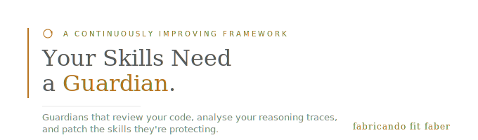
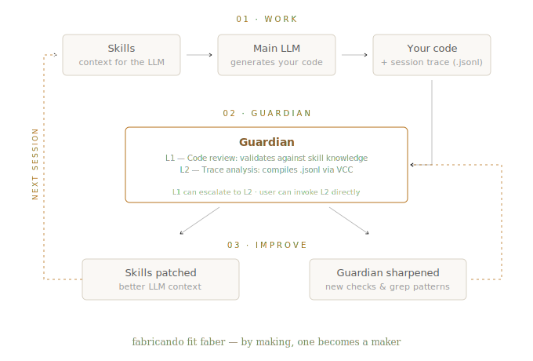
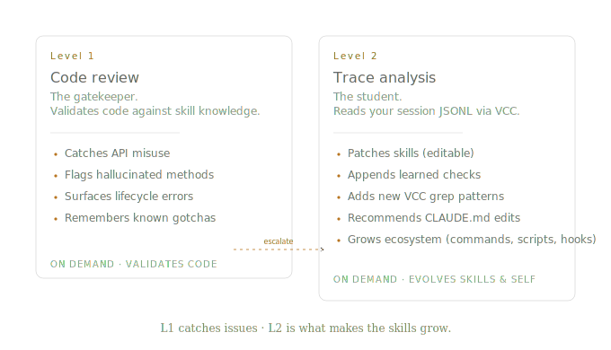

<p align="center">
  
</p>

A framework that creates continuously improving guardian agents for your Claude Code skills. The guardian reviews your code, analyses your session reasoning via VCC, patches your skills when it finds gaps, and sharpens its own eye with every use. Three things improve simultaneously: the skills, the guardian, and your workflow.

You already have skills. But are they getting better?

---

## How it works

<p align="center">
  
</p>

You work with your main LLM while skills provide context. The guardian has two levels:

- **L1 — Code review**: validates your code against the preloaded skill knowledge. Catches API misuse, hallucinated methods, lifecycle errors.
- **L2 — Trace analysis**: compiles the session's JSONL reasoning trace via VCC, identifies skill gaps, patches the skills, and sharpens its own checklist and grep patterns.

You can invoke L1 and let it escalate to L2 if issues are found, or invoke L2 directly with your own context. The improvement loop runs at L2 — each cycle leaves both the skills and the guardian slightly sharper than before.

---

## Agents

The framework has four agents with distinct roles:

| Agent | Role | When to use |
|-------|------|-------------|
| **guardian-nurturer** | Creates continuously improving guardians for any skills | *"Create a guardian for these skills"* |
| **skills-forge** | Builds skills from documentation sources (optional) | *"Build skills from the docs at [path]"* |
| **agent-packager** | Packages skills + guardian for APM distribution | *"Package this for distribution"* |
| **\<tech\>-guardian** | Quality gate + skill/self improvement (generated) | *"Review my code"*, *"Analyse my last session"* |

**guardian-nurturer** is the core. skills-forge is optional — use it if you need to build skills from docs, or bring your own skills from any source.

---

## The guardian — a continuously improving quality gate

<p align="center">
  
</p>

Each guardian carries two types of checks:

- **Base checks** — derived from skills. Editable when the skills are corrected.
- **Learned checks** — accumulated through trace analysis. Append-only.

Both the skills and the guardian improve through use. Level 2 produces a skill gap analysis with concrete patches, CLAUDE.md recommendations, guardian self-updates (new checklist items and VCC grep patterns), and ecosystem growth — commands, scripts, hooks, and analysis tools that the guardian creates when it spots repeated patterns.

---

## Optional: skill building

Don't have skills yet? **skills-forge** builds them from local documentation sources (local paths or git repos). No web scraping — `git clone` is the only allowed network operation. You can also bring skills from any source: hand-written, community repos, other skill builders.

## Optional: APM packaging

**agent-packager** produces [APM](https://github.com/microsoft/apm)-compatible packages:

```
.claude/skill-packages/<tech>/
├── apm.yml
└── .apm/
    ├── skills/
    │   ├── <tech>-core/SKILL.md
    │   └── <tech>-domain/SKILL.md
    └── agents/
        └── <tech>-guardian.agent.md
```

Consumers install via `apm install`, get skills + guardian, and evolve their local copy through use.

---

## Installation

Two paths depending on what you need.

### Path 1 — I already have skills, I just want a guardian

Install guardian-nurturer into your existing project via APM:

```bash
# Install APM if you don't have it
curl -sSL https://aka.ms/apm-unix | sh     # macOS/Linux
irm https://aka.ms/apm-windows | iex       # Windows

# Install guardian-nurturer into your project
apm install Bantarus/YSNG

# Install VCC (required for trace analysis)
git clone https://github.com/lllyasviel/VCC.git ~/.vcc
cp -r ~/.vcc/skills/* ~/.claude/skills/
```

This deploys `guardian-nurturer.md` to your project's `.claude/agents/`. Point it at your existing skills and it generates a guardian.

### Path 2 — I want the full pipeline (build skills + guardians + package)

Clone the repo and work inside it:

```bash
git clone https://github.com/Bantarus/YSNG.git
cd YSNG

# Install VCC (required)
git clone https://github.com/lllyasviel/VCC.git ~/.vcc
cp -r ~/.vcc/skills/* ~/.claude/skills/

# Optional: install APM for packaging
curl -sSL https://aka.ms/apm-unix | sh
```

This gives you the complete framework: skills-forge (skill builder) → guardian-nurturer (guardian builder) → agent-packager (APM distribution), plus agent memory, Phase 8 feedback loop, and the APM skills.

### Dependencies

| Dependency | Required for | Install |
|---|---|---|
| [VCC](https://github.com/lllyasviel/VCC) | Guardian trace analysis (Mode 2) | `git clone` + copy skills |
| Python 3.10+ | VCC | System package manager |
| [APM](https://github.com/microsoft/apm) | Path 1 install + packaging | `curl -sSL https://aka.ms/apm-unix \| sh` |

---

## Project structure (Path 2 — full clone)

```
.claude/
  agents/
    guardian-nurturer.md           # Core — creates guardians for any skills
    skills-forge.md                # Optional — builds skills from docs
    agent-packager.md              # APM packaging specialist
  skills/
    apm-packaging/                 # APM manifest schema (preloaded by agent-packager)
    apm-cli/                       # APM CLI reference (preloaded by agent-packager)
    apm-distribution/              # APM distribution (preloaded by agent-packager)
.apm/
  agents/
    guardian-nurturer.agent.md     # APM-deployable copy (for Path 1 consumers)
apm.yml                            # Package manifest (enables apm install)
```

External skills (install separately):

- `conversation-compiler` — from [VCC](https://github.com/lllyasviel/VCC), preloaded by guardian-nurturer
- `skill-creator` — official Anthropic skill writing guide, preloaded by skills-forge

---

## Usage

### Create a guardian for existing skills

```
Create a guardian for my <tech> skills
My skills need a guardian
Build a guardian for the skills at .claude/skills/<tech>-*
```

guardian-nurturer reads your skills, extracts API surface and gotchas, and generates a tailored guardian with VCC integration and self-improvement.

### Build skills from documentation (Path 2 only)

```
Build skills for [technology] from the docs at [local path or git repo URL]
```

skills-forge runs the skill-building pipeline, then hands off to guardian-nurturer.

### Use the guardian

```
Use <tech>-guardian to review my changes
Have <tech>-guardian debug this error: [paste error]
Run <tech>-guardian on the last session and update the skills
The LLM got this wrong — have the guardian fix the skill
```

### Package for distribution (Path 2 only)

```
Package the <tech> skills for APM distribution
```

---

## License

MIT — fork freely, adapt to your workflow.

See [CONTRIBUTING.md](CONTRIBUTING.md) for the philosophy: this is a starting point, not a destination. Fork it, shape it, make it yours.
